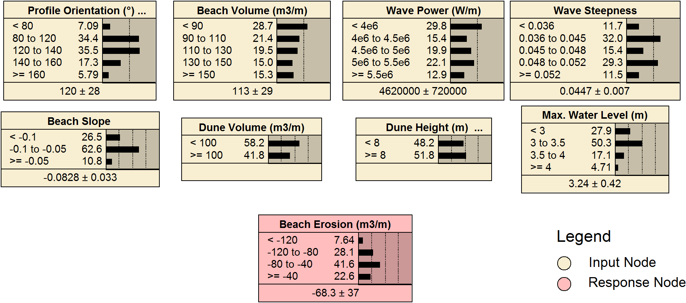
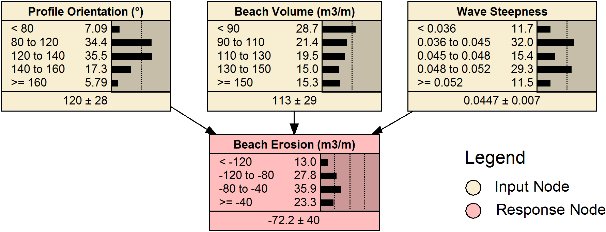

# CVNetica_VS
A Python package to perform wrapper-based variable selection and cross-validation on Bayesian Networks using the software [Netica](https://www.norsys.com/netica.html).

*Written by Joshua Simmons and Tomas Beuzen extending the functionality of CVNetica.*

An accompanying description of the software can be found in the publication:

T. Beuzen, J. Simmons, 2019. A variable selection package driving Netica with Python, Environmental Modelling & Software. 115, pp. 1–5. doi:[10.1016/j.envsoft.2019.01.018](https://doi.org/10.1016/j.envsoft.2019.01.018).

## 1. Description
Bayesian Networks (BNs) are useful methods of probabilistically modelling environmental systems. BN performance is sensitive to the number of variables included in the model framework. The selection of the optimum set of variables to include in a BN (“Variable Selection”) is therefore a key part of the BN modelling process.


*Visualisation (using the Netica software package) of the input and response variables tested in an example application of CVNetica_VS. The aim is to find the optimum set of inputs for modelling the response variable Beach Erosion.*

CVNetica_VS is an open-source Python module that extends the functionality of [Netica](https://www.norsys.com/netica.html), a commonly used commercial BN software package (with a full-featured free version that is only limited in model size), to perform variable selection. CVNetica_VS uses wrapper-based variable selection and cross-validation to search for the optimum variable set to use in a BN.

This package is an extension of the [CVNetica](https://github.com/mnfienen-usgs/CVNetica) package developed by [Fienen and Plant (2015)](https://doi.org/10.1016/j.envsoft.2014.09.007).

## 2. Usage
A demonstration of the use of CVNetica_VS is provided in the [Jupyter Notebook](https://jupyter.org) *CVNetica_VS_EXAMPLE.ipynb* and is shown briefly below. Descriptions of all CVNetica_VS settings are provided below.

### 2.1 Python code
```python
# Load CVNetica from directory ./CVNetica_VS/ containing the module
from CVNetica_VS_run import run_VS

# Define settings to run CVNetica_VS
VS_settings = {
    #run_settings
    'verboselvl': 2,
    'warningstofile': True,

    # control_data
    'baseNET': './example_data/TEST_Net_2.neta',
    'baseCAS': './example_data/TEST_Dune_Erosion_Data.cas',
    'pwdfile': 'NA.txt',

    # kfold_data
    'CVflag': True,
    'numfolds': 2,

    #scenario
    'working_dir': './example_data/local_output/',
    'input_vars': ['width0','vol0','d50','cumPxs','WIH3','maxTWL'],
    'response_vars': ['dVBp'],
    'combinations': [1,2,3,4],
    'output_file': './example_data/output.csv',

    #learnCPTdata
    'voodooPar': 1,
    'EMflag': False,
}

# Now run CVNetica_VS based on the variables specified above
netsRun, performance_data = run_VS(VS_settings)
```

### 2.2 Settings
* `verboselvl`: (1 - 3; default: 2) A smaller value prints less information to the screen.
* `warningstofile`: (True/False; default: True) If True then warnings are sent to the file *./warnings.txt*.
* `baseNET`: Path to a Netica .neta file containing the BN.
* `baseCAS`: Path to a Netica .cas file containing the training data.
* `pwdfile`: (Defaults to dummy file to use free version; default: 'NA.txt') Path to a Netica license file to use the full version of Netica - this is not necessary to use the free version of Netica.
* `CVflag`: (True/False; default: True) If True then cross-validation (CV) will be undertaken when testing each CVNetica_VS subset BN.
* `numfolds`: (Any integer; default: 5) Specifies the number of folds to use in CV.
* `working_dir`: Path to directory where all BNs constructed by CVNetica_VS are temporarily stored while being run.
* `input_vars`: The input variables in the BN from which subsets will be tested (as per the *combinations* setting).
* `response_vars`: The response variable to be predicted.
* `combinations`: (List of integers; default [2]) A list of integers that specifies which input variables subsets CVNetica_VS should test. e.g., if provided [1,2,3], CVNetica_VS would try all combinations of 1, 2, and 3 input variables.
* `output_file`: Path to output .csv file where CVNetica_VS stores performance metrics for all of the variable selection tests.
* `voodooPar`: (Integer; default: 1) Value used to tune conditional probability tables (CPTs) learning when using counting-learning.
* `EMflag`: (True/False; default: False) If True then expectation maximisation will be used to learn CPTs.

### 2.3 Outputs
* `netsRun`: A list of objects (one per trialled subset) which each object containing:
    * `netName`: Path of the trialled net.
    * `nodesIn`: Input variables used in this trial.
    * `nodesOut`: Response variable(s) used in this trial.
    * `statsData`: Stores raw data from cross-validation runs.
* `performance_data`: Contains a pandas dataFrame object (specifically at `performance_data.df`) filled with the summarised data for all trials to be output to the .csv file (*output_file*). Output performance metrics include:
    * *RMSE*: root mean square error
    * *sk*: skill
    * *logloss*: log loss
    * *errrate*: error rate
    * *quadloss*: quadratic loss

CVNetica_VS collects the performance metrics of each variable subset and these metrics are output to a .csv file at a path specified using the key *output_file*. An example of this output is shown below.

| Combination ID | Input Variables | | | | | | | | Response Variable | Performance Metric |
| --- | --- | --- | --- | --- | --- | --- | --- | --- | --- | --- |
|  | Dune Height | Dune Volume | Beach Volume | Profile Orientation | Beach Slope | Wave Power | Wave Steepness | Max. Water Level | Beach Erosion | Error Rate (mean) |
| 74 | 0 | 0 | 1 | 1 | 0 | 0 | 1 | 0 | 1 | 0.142 |
| 129 | 0 | 1 | 1 | 1 | 0 | 0 | 1 | 0 | 1 | 0.157 |
| 109 | 1 | 0 | 1 | 1 | 0 | 0 | 1 | 0 | 1 | 0.158 |
| 148 | 0 | 0 | 1 | 1 | 1 | 0 | 1 | 0 | 1 | 0.175 |
| ... | | | | | ... | | | | | ... |

You can use these results to determine an optimum selection of variables for modelling.


*An optimised 2-layer BN for modelling Beach Erosion identified by CVNetica_VS. The BN is composed of 3 input variables: Profile Orientation, Beach Volume and Wave Steepness.*

## 3. Issues and contributions
Have you found an issue with the code and need to get it fixed? Or perhaps you're looking to contribute to the code and looking for ways it could be improved. In both cases, please see the [Issues page](https://github.com/simmonsja/CVNetica_VS/issues).
